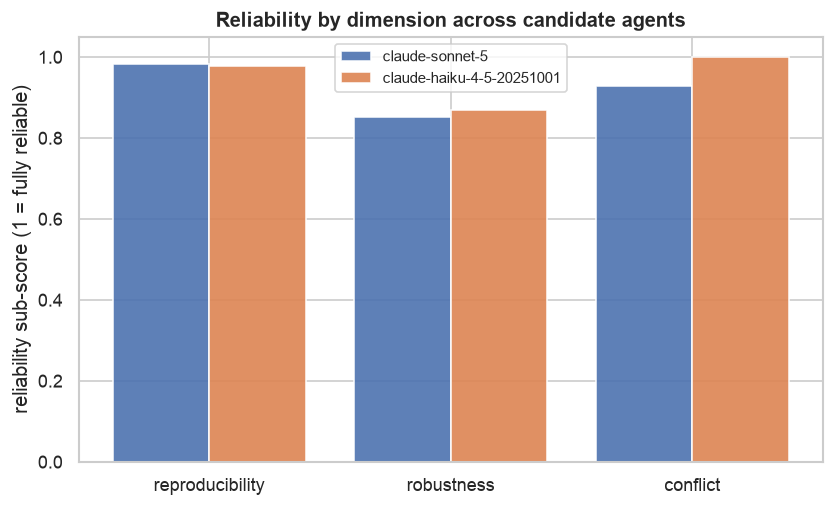

# kavuru-convexia

**A reliability audit harness for LLM-agent drug-asset evaluations.**

Given an agent's verdict on a drug asset — a probability-of-success (PoS) score in
[0, 1], a go/no-go recommendation, and a rationale — `kavuru-convexia` measures
whether that verdict is **reproducible, calibrated, robust, and honest about
conflicting evidence**. It targets the specific failure modes that make an
agentic "should we spend millions acquiring this asset" verdict untrustworthy,
rather than generic task accuracy.

---

## The problem

Convexia's agents source, evaluate, and score early-stage drug assets, and a
keystone PoS agent's verdict drives capital-allocation decisions. When an
evaluative verdict is the thing allocating millions, the binding risk is not
"is the agent occasionally wrong" but **"can we trust this specific verdict enough
to act on it."** Convexia itself names **correctness** and **conflicting evidence**
as open challenges. An unreliable verdict — one that flips on a re-run, swings
when the input is reworded, or quietly ignores a disqualifying tox signal — is
worse than no verdict, because it launders low confidence into a number that looks
decision-ready. This harness is a working prototype of the reliability layer that
de-risks exactly that.

## What it measures

Four first-class audits, each targeting a distinct way an acquisition verdict goes
wrong — not generic accuracy:

| Audit | Question | Needs labels? |
|---|---|---|
| **Reproducibility** | Same asset, same input — does the verdict move run to run? (PoS dispersion, recommendation flip-rate, rationale-citation stability) | No |
| **Robustness** | Do semantics-preserving edits (reorder, entity-neutralization, reformat, paraphrase) move the verdict when they must not? | No |
| **Conflict-handling** | On contradictory evidence, does the verdict acknowledge the conflict, stay consistent, and avoid following evidence *order*? | No |
| **Calibration** | Do predicted PoS scores match realized outcomes on historical assets? (ECE, Brier, AUROC, reliability curve) | **Yes** |

## Why three of the four run in production

Reproducibility, robustness, and conflict-handling are **ground-truth-free**: they
interrogate the agent's *behavior* (re-run it, perturb the input, reorder the
evidence), never the eventual clinical outcome. That is what makes them a
production trust gate — they can score a fresh verdict the moment it is produced,
before anyone knows whether the asset would have succeeded.

**Calibration is different, and we keep the boundary crisp.** It compares predicted
PoS to *realized outcomes*, so it needs labels and can only run **offline**, on a
curated set of historical known-outcome drugs. It validates the agent against
history; it cannot gate a live verdict. The harness never smuggles outcome labels
into the production-usable checks.

## Results

<!-- RESULTS:BEGIN -->
Reference agent: **`claude-sonnet-5`**, 8 repetitions, 20 assets (12 historical +
8 synthetic). The Claude-5 API rejects an explicit `temperature`, so these numbers
measure the model's **native production non-determinism** — not variance we inflated.
Every figure below is committed under [`docs/figures/`](docs/figures) and the full
report under [`docs/sample_report/`](docs/sample_report); reproduce with `make demo`.

**Overall: reliability score `0.92`, status `FAIL`** (the robustness gate).
Of 20 verdicts, **14 pass, 4 warn, 2 fail**.

| Audit | Status | Score | Headline numbers |
|---|---|---|---|
| Reproducibility | WARN | 0.97 | PoS std mean **0.009** (max 0.052), recommendation flip-rate **0%**, rationale-citation Jaccard 0.97 (min **0.81**) |
| Robustness | **FAIL** | 0.86 | mean \|ΔPoS\| 0.027, max 0.12, recommendation-change rate **2.5%** under semantics-preserving edits |
| Conflict | PASS | 0.93 | conflict-acknowledgment **100%**, max anchoring swing 0.045 (< 0.10), 0 order-driven flips |
| Calibration *(offline)* | WARN | 0.43 | **AUROC 1.00**, Brier 0.015, **ECE 0.113**, mean PoS 0.48 vs 0.50 base rate |

What the run actually shows — an honest, non-strawman picture of a SOTA agent:

**1. Reproducible where it counts, but the rationale wanders.** PoS scores barely
move on re-run (std 0.009) and the recommendation never flips. Yet the cited-evidence
set drifts — Jaccard falls to **0.81** on the hardest asset (preladenant): the number
is stable while the stated *why* shifts run to run.


**2. Not robust to cosmetic rewrites — the headline gap.** Edits that cannot change
the answer do. Reordering preladenant's evidence moves its PoS by **0.10** (its verdict
is otherwise rock-stable, so this is real drift, not noise); on the efficacy-vs-tox
asset, stripping the entity name *and* paraphrasing each flip the recommendation
**`pass` → `investigate`**. The audit is noise-controlled — a 0.12 swing on
verubecestat is *not* flagged, because that asset is natively noisy and the swing sits
inside its own run-to-run band. Mean drift is small (0.027), but the tail is exactly
where capital gets misallocated, and it is invisible without this audit.


**3. Handles conflicting evidence well.** It acknowledges **100%** of planted
conflicts, shows a max positional-anchoring swing of 0.045 (below the 0.10 fail line),
and never lets evidence *order* flip the verdict.

**4. Perfect ranking, imperfect calibration — with a memorization caveat.** On the 12
historical drugs it separates the 6 approved from the 6 discontinued **flawlessly
(AUROC 1.00, Brier 0.015)**, yet its **ECE is 0.113**: the absolute PoS values are mildly
miscalibrated even though the ordering is perfect. Stripping each drug's identity
(name-blinding) barely moves the verdict and leaves **AUROC at 1.00 (change +0.00)** —
so the agent is not anchoring on the brand *string*. That does **not** rule out
memorization: the mechanism and indication still identify these iconic drugs, so a
clean read needs held-out assets. Mean PoS (0.48) sits on the set's balanced base rate,
so there is no systematic optimism here; the published ~7.9% Phase-1→approval rate is
the anchor a real-world PoS distribution should be checked against, not this set.


**5. It ranks candidate agents.** The gate's real job. On the synthetic set it scores
`claude-sonnet-5` at **0.93** and `claude-haiku-4-5` at **0.94** on the production-usable
axes — both fail the robustness bar, and the gate says which verdicts to trust for each.


<!-- RESULTS:END -->

## How it slots onto the PoS agent

`kavuru-convexia` sits behind any evaluator that implements one method:

```python
class AssetEvaluator(ABC):
    def evaluate(self, asset, *, temperature=None, cache_tag="") -> Verdict: ...
```

- **`ReferenceAgent`** — a bundled LLM agent that stands in for a production PoS
  agent (swap in your model via `config.ANTHROPIC_MODEL`).
- **`ExternalAdapter`** — ingests verdicts captured from an external system,
  including Convexia's public playground, and runs them through the **identical**
  audit pipeline. See [`playground_protocol.md`](playground_protocol.md).

In production it becomes a **reliability gate**: every PoS verdict is scored for
reproducibility, robustness, and conflict-handling, and the verdict carries a
reliability score plus flags — e.g. _"recommendation flipped `pass`→`investigate`
under paraphrase; +0.10 PoS drift under evidence reorder → do not act on this verdict
without human review."_ Verdicts that clear the gate go forward; the rest are routed
to a human.
Applied to two candidate agents, it tells you which one to put in the capital path.

## Quickstart

```bash
make setup                      # build .venv, install the package + dev deps
export ANTHROPIC_API_KEY=...     # required for the reference agent
make demo                        # full audit -> figures + report + notebook in outputs/
make test                        # test suite (offline, no network)
```

`make demo` runs the whole story — build assets → run the reference agent → audit
reproducibility / robustness / conflict → calibrate against historical outcomes →
render figures and a per-verdict reliability report, and execute the demo notebook
into `outputs/demo.ipynb`. Every quantitative claim above is reproduced by it.

## Repository layout

```
config.py                       # re-export of the canonical config (seeds, model, thresholds)
playground_protocol.md          # honest protocol for auditing a live playground
src/kavuru_convexia/
  assets.py                     # typed asset + evidence schema; historical + synthetic sets
  evaluator.py                  # AssetEvaluator ABC, ReferenceAgent, ExternalAdapter, Verdict
  llm.py                        # disk-cached Anthropic client (+ offline stub)
  audits/
    reproducibility.py          # variance / flip-rate / rationale stability (no labels)
    robustness.py               # verdict drift under semantics-preserving edits (no labels)
    conflict.py                 # conflict acknowledgment / consistency / anchoring (no labels)
    calibration.py              # reliability curve, ECE, Brier, AUROC (labels; offline)
    report_types.py             # CheckResult, AssetReliabilityEntry, VerdictReliabilityReport
    __init__.py                 # audit_agent orchestrator -> VerdictReliabilityReport
  reporting.py                  # figures + markdown/JSON report
  notebook_builder.py           # end-to-end demo (make demo entry point)
tests/                          # schema + per-audit detector tests (adversarial stubs)
```

## Honest limitations and next steps

<!-- LIMITATIONS:BEGIN -->
- **One model family.** The numbers are for a single Claude model. The harness is
  model-agnostic (`config.ANTHROPIC_MODEL` + `ExternalAdapter`), but a broader agent
  panel would sharpen the conclusions.
- **Native non-determinism only.** Claude-5 rejects an explicit `temperature`, so
  reproducibility reflects the model's *native* production variance; a
  temperature-exposed deployment would likely disperse more. The harness measures
  whatever the deployment actually does — it does not inflate variance.
- **Outcome memorization.** The historical set uses famous real drugs, so the agent
  may recognize them and recall outcomes — which is why revealed-identity AUROC is so
  high. The identity-blinding check *quantifies* this (see Results), but true blinding
  is impossible for iconic drugs (mechanism + indication identify them). A production
  calibration needs held-out or contemporaneous assets the model cannot have memorized.
- **Small, balanced calibration set.** 12 labeled assets, balanced by construction;
  ECE on 12 points is coarse even at capped bin resolution. This is an offline sanity
  check, not a production metric — larger, time-sliced, outcome-labeled banks sharpen it.
- **Curated evidence.** Snippets are faithful reconstructions of the pre-decision
  picture, not raw trial data; calibration measures judgment over a stylized dossier.
- **Judge non-determinism.** Conflict acknowledgment uses an LLM judge (+ heuristic
  fallback) at temperature 0 with caching; a judge panel would be more robust — the
  very variance this project studies also affects judges.
- **Refusals are real.** During development the safety layer refused an asset outright;
  a production gate should treat refusal/availability as a first-class reliability
  signal (the harness now surfaces empty/refused responses as a parse failure).

**Next steps:** plug Convexia's playground verdicts in via `ExternalAdapter` (protocol
included); expand and time-slice the historical bank; add a judge panel and per-verdict
human-review routing; wire the gate as a pre-commit check in the acquisition pipeline;
extend the perturbation set (numeric-magnitude edits, evidence-dropout sensitivity).
<!-- LIMITATIONS:END -->

## Data provenance & honesty

The historical calibration set contains real drugs whose **outcomes are hard facts**
confirmed against cited public sources and independently re-verified by an
adversarial checker (see `_verification` in `src/kavuru_convexia/data/historical_assets.json`).
The **evidence snippets are curated editorial reconstructions** of the pre-decision
risk/benefit picture — not verbatim trial data, and deliberately written not to
leak the outcome so the calibration test requires genuine inference. Synthetic
assets are programmatically constructed with planted patterns. No number in this
README is hand-entered; all are produced by `make demo`.

## Author note

Built by Rikhin Kavuru as a demonstration artifact. The methodology follows the
measurement-reliability framing of Kavuru, _"Measurement Reliability in LLM Agent
Evaluation: Variance, Judge Non-Determinism, and the Limits of Benchmark
Inference"_ (INFORMS) — that reliability of evaluative verdicts (variance,
judge non-determinism) is a first-class property to measure, not an afterthought.
