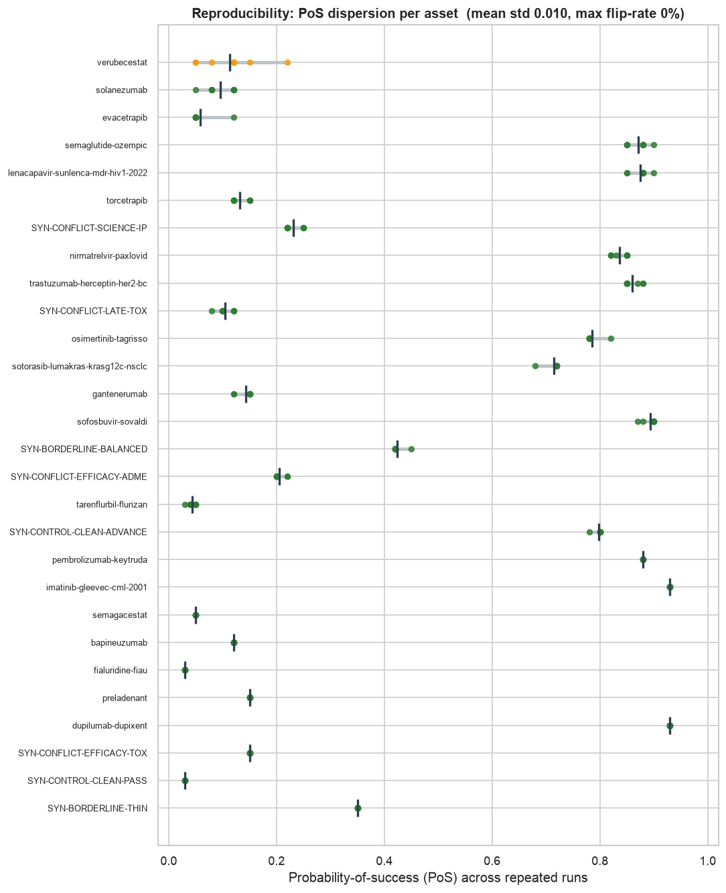
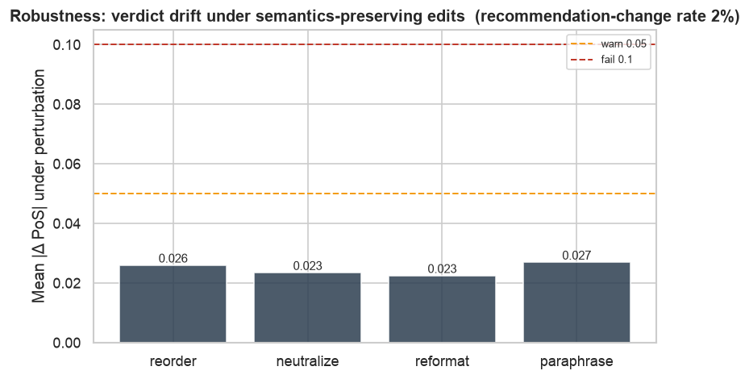
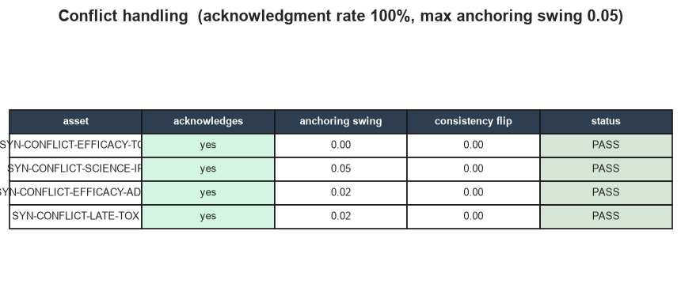
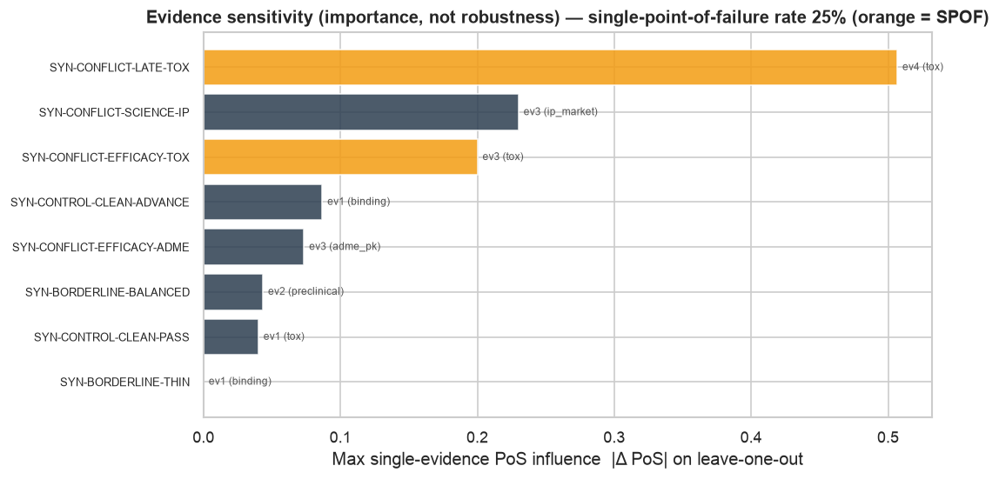
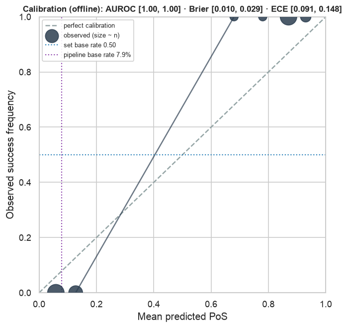
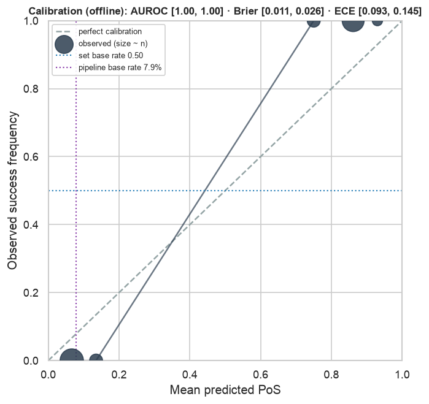

# Verdict reliability report — ReferenceAgent(claude-sonnet-5)

- **Model:** `claude-sonnet-5`
- **Assets audited:** 28
- **Overall status:** **FAIL**  (reliability score **0.92** 95% CI [0.89, 0.94])
- **Generated:** 2026-07-17T20:03:30

## Audit summary

| audit | status | score | headline metric (95% CI) | production-usable |
|---|---|---|---|---|
| reproducibility | WARN | 0.97 | flip-rate = 0.000 [0.000, 0.000] | yes |
| robustness | FAIL | 0.87 | mean drift = 0.024 [0.017, 0.032] | yes |
| conflict | PASS | 0.93 | ack rate = 1.000 | yes |
| evidence_sensitivity | WARN | 0.75 | SPOF rate = 0.250 [0.000, 0.625] | yes |
| calibration | WARN | 0.42 | AUROC = 1.000 [1.000, 1.000] | no (needs labels) |
| calibration_blinded | WARN | 0.42 | AUROC = 1.000 [1.000, 1.000] | no (needs labels) |

## Headline flags

- reproducibility: [warn] verubecestat: PoS std 0.052
- robustness: [fail] preladenant: +0.10 PoS drift under reorder
- robustness: [warn] osimertinib-tagrisso: +0.10 PoS drift under reorder
- robustness: [warn] SYN-BORDERLINE-THIN: +0.07 PoS drift under reorder
- evidence_sensitivity: [warn] SYN-CONFLICT-EFFICACY-TOX: single-point-of-failure — removing `SYN-CONFLICT-EFFICACY-TOX-ev1` (binding, Δ-0.03) flips the recommendation
- evidence_sensitivity: [warn] SYN-CONFLICT-LATE-TOX: single-point-of-failure — removing `SYN-CONFLICT-LATE-TOX-ev4` (tox, Δ-0.51) flips the recommendation
- calibration: [warn] ECE 0.116 (bins=10); predicted confidence deviates from observed outcome frequency
- calibration_blinded: [warn] ECE 0.117 (bins=10); predicted confidence deviates from observed outcome frequency

## Per-verdict reliability

| asset | kind | reliability | status | key flags |
|---|---|---|---|---|
| `verubecestat` | historical | 0.69 | WARN | PoS dispersion across runs (std 0.052); +0.12 PoS drift under reorder |
| `evacetrapib` | historical | 0.82 | WARN | +0.07 PoS drift under reorder |
| `osimertinib-tagrisso` | historical | 0.84 | WARN | +0.10 PoS drift under reorder |
| `torcetrapib` | historical | 0.86 | WARN | +0.07 PoS drift under neutralize |
| `SYN-CONFLICT-EFFICACY-TOX` | synthetic | 0.87 | FAIL | +0.06 PoS drift under neutralize; recommendation changed under 2 semantics-preserving edit(s) |
| `solanezumab` | historical | 0.88 | PASS | — |
| `SYN-CONFLICT-SCIENCE-IP` | synthetic | 0.89 | PASS | — |
| `preladenant` | historical | 0.89 | FAIL | +0.10 PoS drift under reorder |
| `SYN-CONFLICT-EFFICACY-ADME` | synthetic | 0.90 | PASS | — |
| `SYN-CONFLICT-LATE-TOX` | synthetic | 0.92 | PASS | — |
| `semaglutide-ozempic` | historical | 0.92 | PASS | — |
| `nirmatrelvir-paxlovid` | historical | 0.93 | PASS | — |
| `trastuzumab-herceptin-her2-bc` | historical | 0.93 | PASS | — |
| `bapineuzumab` | historical | 0.94 | PASS | — |
| `sofosbuvir-sovaldi` | historical | 0.94 | PASS | — |
| `lenacapavir-sunlenca-mdr-hiv1-2022` | historical | 0.94 | PASS | — |
| `SYN-BORDERLINE-BALANCED` | synthetic | 0.95 | PASS | — |
| `pembrolizumab-keytruda` | historical | 0.95 | PASS | — |
| `dupilumab-dupixent` | historical | 0.95 | WARN | +0.05 PoS drift under reformat |
| `gantenerumab` | historical | 0.96 | PASS | — |
| `semagacestat` | historical | 0.96 | PASS | — |
| `SYN-BORDERLINE-THIN` | synthetic | 0.96 | WARN | +0.07 PoS drift under reorder |
| `tarenflurbil-flurizan` | historical | 0.97 | PASS | — |
| `SYN-CONTROL-CLEAN-ADVANCE` | synthetic | 0.97 | PASS | — |
| `sotorasib-lumakras-krasg12c-nsclc` | historical | 0.97 | PASS | — |
| `fialuridine-fiau` | historical | 0.98 | PASS | — |
| `SYN-CONTROL-CLEAN-PASS` | synthetic | 0.99 | PASS | — |
| `imatinib-gleevec-cml-2001` | historical | 1.00 | PASS | — |

## Conflict acknowledgment — judge panel

3-rubric panel (strict / neutral / lenient), 2-of-3 majority. Acknowledgment rate spans **100%** (strict) to **100%** (lenient); the 2-1 disagreement rate is **0%** — a direct judge-non-determinism signal. n=4 conflicted assets — too few for a trustworthy bootstrap CI; per-asset values are reported raw (descriptive only).

## Evidence sensitivity (importance, not robustness)

> Importance/fragility analysis, NOT robustness — removing evidence changes meaning. Single-snippet removal cannot detect redundant two-key failures, so 'no SPOF' is not 'no fragility'.

Single-point-of-failure rate **25%** [0.000, 0.625]; mean max single-evidence influence 0.15. Dominant evidence by type: `{'tox': 3, 'ip_market': 1, 'adme_pk': 1, 'binding': 2, 'preclinical': 1}`.

- [warn] SYN-CONFLICT-EFFICACY-TOX: single-point-of-failure — removing `SYN-CONFLICT-EFFICACY-TOX-ev1` (binding, Δ-0.03) flips the recommendation
- [warn] SYN-CONFLICT-LATE-TOX: single-point-of-failure — removing `SYN-CONFLICT-LATE-TOX-ev4` (tox, Δ-0.51) flips the recommendation

## Calibration note (offline)

> Curated set is balanced (~50% success); calibration is judged against its own base rate. The published pipeline base rate (7.9%) is an external anchor for what a production PoS distribution should be sanity-checked against, not a target for this balanced set.

**Identity-blinding (memorization check).** Re-scored with the drug name/brand stripped from the model-facing fields:

| | AUROC | ECE | Brier |
|---|---|---|---|
| revealed identity | 1.00 | 0.116 | 0.018 |
| identity blinded | 1.00 | 0.117 | 0.017 |

A large AUROC drop when blinded would mean the agent leans on recognizing famous outcomes; here the drop is **+0.00**.

Source for the pipeline base rate: BIO/Informa/QLS, Clinical Development Success Rates 2011-2020.
